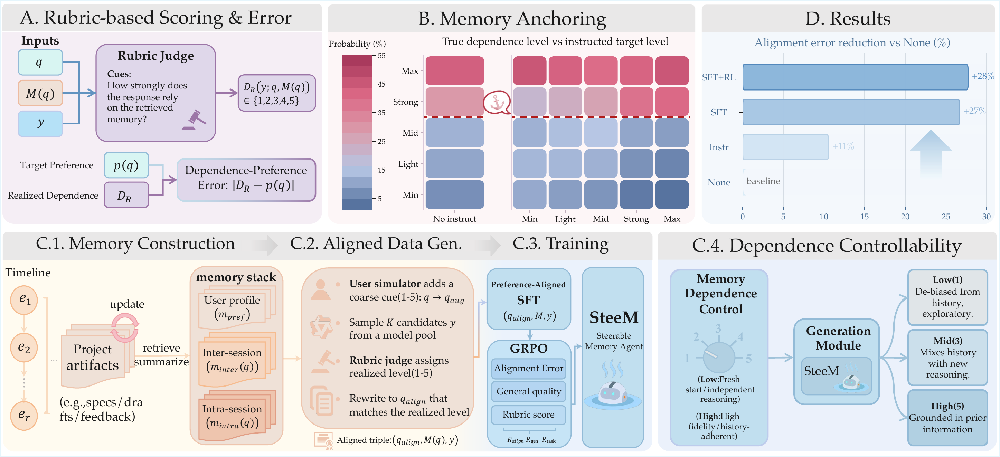

# Controllable Memory Usage: Balancing Anchoring and Innovation in Long-Term Human-Agent Interaction

[](https://arxiv.org/abs/2601.05107)

This repository contains the public, sanitized code and released timeline data for our paper on controllable memory usage in long-term human-agent interaction.

We study how an agent's reliance on memory can be treated as an explicit, user-controllable behavior dimension. The code in this release focuses on the data construction and evaluation pipeline around long-horizon interaction traces, artifact evolution, cross-session preference summaries, and memory-dependence evaluation.

## Paper

- arXiv page: [Controllable Memory Usage: Balancing Anchoring and Innovation in Long-Term Human-Agent Interaction](https://arxiv.org/abs/2601.05107)

This repository is the sanitized companion release for the paper. The work studies controllable memory dependence in long-term human-agent interaction: instead of treating memory usage as an all-or-nothing hidden policy, we model it as a preference that users can implicitly specify and that an agent can learn to follow.

The paper contributes three core pieces:

- a rubric-based formulation for measuring how strongly a response depends on retrieved memory
- a long-horizon synthetic data construction pipeline built from timelines, evolving artifacts, and cross-session summaries
- SteeM, a training recipe that combines preference-aligned data generation, SFT, and GRPO to improve memory-dependence controllability

## Paper Preview

<p align="center">
  <a href="docs/main.pdf">
    
  </a>
</p>

## What Is Included

- Core pipeline code under `framework_data/`:
  - `event/`: long-horizon event timeline generation
  - `concept/`: concept extraction from event timelines
  - `artifacts/`: evolving artifact generation over time
  - `cross-session/`: task-specific cross-session summaries
  - `composed_memory/`: episodic and retrieved memory composition
  - `all_context_merge/`: query rules and persona templates
- Evaluation scripts under `evaluation/`:
  - job creation
  - memory-bank generation
  - query/rubric/answer generation
  - rubric resources
- Public timeline data under `data/timeline/`:
  - 194 research timelines
  - 194 tutoring timelines
  - each case includes `events.json` and `stats.json`
- Main paper figure under `docs/`

## Repository Structure

```text
data/
  timeline/
    research/
    tutoring/
framework_data/
  all_context_merge/
  artifacts/
  composed_memory/
  concept/
  cross-session/
  event/
evaluation/
  general_rubrics/
  make_test_data/
  preference_rubrics/
docs/
  main.pdf
  main.png
```

## Environment Setup

```bash
python -m venv .venv
source .venv/bin/activate
pip install -r requirements.txt
cp .env.example .env
```

Set API credentials through environment variables before running any generation script.

## Quick Start

Generate sample timelines:

```bash
bash framework_data/event/run_generate.sh
```

Generate concepts from example mixed cases:

```bash
bash framework_data/concept/run_generate.sh
```

Generate artifacts from example event outputs:

```bash
bash framework_data/artifacts/run_generate.sh
```

Generate cross-session summaries from example mixed cases:

```bash
bash framework_data/cross-session/run_generate.sh
```

Compose episodic and retrieved memories:

```bash
bash framework_data/composed_memory/run_compose.sh
```

## Released Timeline Data

The public timeline release is stored in `data/timeline/`. It contains 388 synthesized project trajectories in total: 194 `research` cases and 194 `tutoring` cases. The number of timeline steps ranges from 16 to 25 in both domains.

Each case directory contains:

- `events.json`: the structured timeline, with fields such as `event_id`, `time_index`, `event_type`, `description`, `required_artifacts`, `generated_artifacts`, and `reason`
- `stats.json`: generation-time bookkeeping such as token counts and the total number of steps

For privacy and release hygiene, we do not publish the corresponding `interactions.json` files in this repository. Those logs contain prompt-level generation traces and are intentionally excluded from the public release.

For the detailed data description, see `data/timeline/README.md`.

## Evaluation Note

The evaluation scripts are included for transparency and code release completeness, but this repository is not intended to be a maintained, one-command public benchmark package. In particular, we do not document or ship an official public evaluation split in the README.

If you want to build your own downstream jobs from the released timelines, you can start from:

```bash
python evaluation/make_test_data/make_jobs.py \
  --root data/timeline \
  --out /tmp/timeline_jobs.jsonl \
  --out_base evaluation/test_set
```

## Citation

If you use this repository, please cite the paper:

```bibtex
@article{tian2026controllable,
  title={Controllable Memory Usage: Balancing Anchoring and Innovation in Long-Term Human-Agent Interaction},
  author={Tian, Muzhao and Huang, Zisu and Wang, Xiaohua and Xu, Jingwen and Guo, Zhengkang and Qian, Qi and Song, Kaitao and Yuan, Jiakang and Lv, Changze and Zheng, Xiaoqing},
  year={2026}
}
```
