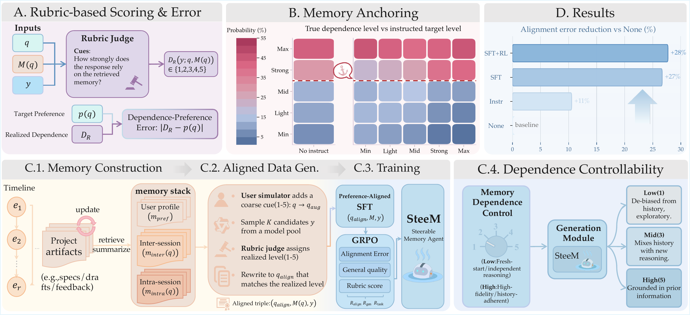

<div align="center">

<h2 align="center">
  &nbsp;&nbsp;&thinsp;Controllable Memory Usage: Balancing<br>Anchoring and Innovation in Long-Term Human-Agent Interaction
</h2>

<p>
  <a href="https://arxiv.org/abs/2601.05107"></a>
  <a href="paper/steem_memory_control_paper.pdf"></a>
  <a href="LICENSE"></a>
  
</p>

<p>
  <a href="#-overview">Overview</a> |
  <a href="#-released-assets">Assets</a> |
  <a href="#-quick-start">Quick Start</a> |
  <a href="#-citation">Citation</a>
</p>

<p>
  <b>Models memory reliance as a user-controllable dimension—enabling regulation from fresh-start innovation to history-adherent personalization.</b>
</p>

</div>

## 📖 Overview

As LLM-based agents are increasingly used in long-term interactions, cumulative memory is critical for personalization and stylistic consistency. However, most systems adopt an "all-or-nothing" approach—incorporating all past information can lead to **Memory Anchoring** (the agent is trapped by past interactions), while excluding memory entirely results in under-utilization.

**SteeM** introduces a framework that models memory reliance as an *explicit, user-controllable dimension*, allowing dynamic regulation from a **fresh-start mode** (promoting innovation) to a **high-fidelity mode** (closely following interaction history).

<p align="center">
  
</p>

<p align="center"><em>SteeM introduces rubric-based memory-dependence scoring, preference-aligned data generation, training, and controllable generation modes ranging from fresh-start to history-adherent behavior.</em></p>

### ✨ Key Contributions

- **Memory Dependence Metric** — A behavioral metric to quantify the influence of past interactions on current outputs
- **Steerable Generation** — Users can dynamically regulate memory reliance at inference time
- **Data Pipeline** — A complete pipeline for constructing long-term interaction contexts with timelines, artifacts, concepts, and cross-session summaries
- **Consistent Improvements** — Outperforms conventional prompting and rigid memory masking strategies across scenarios

---

## 📦 Released Assets

| Asset | Description |
|-------|-------------|
| [`timeline_generation/output_gemini`](data_pipeline/timeline_generation/output_gemini) | 194 research + 194 tutoring cases (`events.json` & `stats.json`) |
| [`context_merge/all_contexts.json.gz`](data_pipeline/context_merge/all_contexts.json.gz) | 11,541 merged query-context examples (gzip) |
| [`context_merge/sampled_contexts.json`](data_pipeline/context_merge/sampled_contexts.json) | 400 sampled context examples |
| [`memory_control_method/`](memory_control_method) | Complete method code for controllable memory |

---

## 🚀 Quick Start

### Installation

```bash
git clone https://github.com/Moore-Tian/SteeM-Memory-Control.git
cd SteeM-Memory-Control
pip install -r requirements.txt
```

### Environment Variables

```bash
export OPENAI_API_KEY="your-api-key"
export OPENAI_BASE_URL="https://..."  # optional
```

### Data Pipeline

Run the stages sequentially from the repository root:

```bash
# Step 1: Generate interaction timelines
bash data_pipeline/timeline_generation/run_generate.sh

# Step 2: Generate artifacts
bash data_pipeline/artifact_generation/run_generate.sh

# Step 3: Extract concepts
bash data_pipeline/concept_generation/run_generate.sh

# Step 4: Build cross-session summaries
bash data_pipeline/cross_session_generation/run_generate.sh
```

### Evaluation

```bash
MODEL_PATH=/path/to/model \
TEST_DATA_PATH=/path/to/test_data.jsonl \
RUN_JUDGE=1 \
RUN_METRIC=1 \
bash memory_control_method/evaluation/run_evaluation_pipeline.sh
```

---

## 📝 Citation

If you find this work useful, please cite our paper:

```bibtex
@article{tian2026controllable,
  title={Controllable Memory Usage: Balancing Anchoring and Innovation in Long-Term Human-Agent Interaction},
  author={Tian, Muzhao and Huang, Zisu and Wang, Xiaohua and Xu, Jingwen and Guo, Zhengkang and Qian, Qi and Shen, Yuanzhe and Song, Kaitao and Yuan, Jiakang and Lv, Changze and Zheng, Xiaoqing},
  journal={arXiv preprint arXiv:2601.05107},
  year={2026}
}
```

